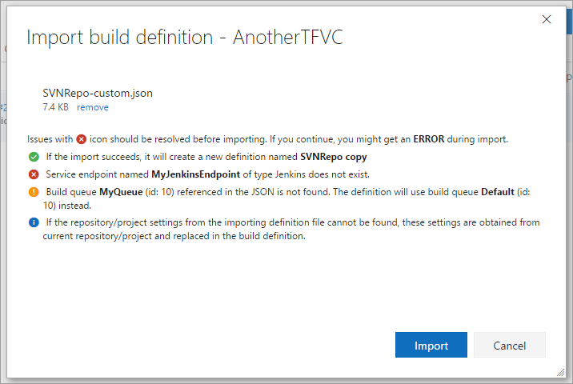
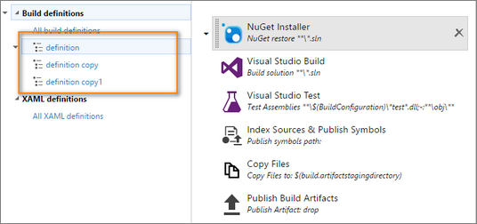

# Export/Import Build Definition

Download this extension from the [VS Marketplace](http://bit.ly/exportimportbuild) or get the specific version from [Releases](https://github.com/onlyutkarsh/ExportImportBuildDefinition/releases).

---------------------------------------

> **Thanks to all of you for using this extension. Unfortunately, I am not able to work on this extension lately. I am aware of these problems, but it is becoming hard for me to keep the extension up to date with the API changes and ECMA compatibility for all supported browsers due to time constraints.**

Export and Import your build definitions. Useful for recreating all the build steps, variables, schedules, etc in a different team project.

See the [change log](.github/CHANGELOG.md) for changes and road map.

## Features 
- Version control your definitions (exported file is a JSON file, which can be checked-in in to your source control as any other file). 
- Avoid manually duplicating the definition in another team project/account.
- No need to manually add steps and set their values.
- The extension also validates and highlights any missing service endpoints.

> **Note:** The extension only supports new (non XAML) build definitions.

### Export build definition ###

- Right-click and click `Export` on the build definition you would like to export.
- You will be prompted save the definition as a file.
- Save the file with JSON extension.

### Import build definition ###

- Right click on any existing build definitions and click on `Import`.
- You will be prompted to upload a build definition file.
- You can either drag and drop a file or use the `Browse` button to select the file you want to import.
- Once you upload the file, the file will be parsed and the dialog will highlight you if any issues with the definition.

  

- Click `Import`. If import is successful, you will have your build created, with all your steps, variables, schedules and other build definition parameters.

## Get Started ##

To contribute to this project, you'll need to do a few things first:

- Fork the project on GitHub
- Clone it to your computer
- Install [Visual Studio Code](http://code.visualstudio.com/)
- Open the the folder you cloned in Code.
- Run `npm install` when in the directory you cloned (directory containing `package.json` file).

To install local fork into your on-premise TFS (TFS 2017 and above) using VSIX, run `npm run package:dev` which will create the VSIX file. You can then upload it into TFS by following steps mentioned [here](https://www.visualstudio.com/en-us/docs/marketplace/get-tfs-extensions).

You can also automate the publishing step by running `npm run publish:dev` command.

Finally, To see the `Export` and `Import` menu items, you need to run the web pack dev server by running `npm run dev` command.

## License
[MIT](LICENSE.txt)
